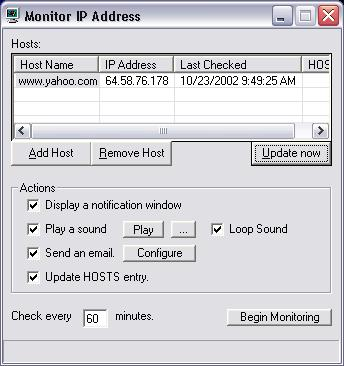



## Monitor Dynamic IP Address

### Description

I have a website that runs off a dynamic ip address. Using ZoneEdit and DynamicUpdate I can publish my IP address to my DNS sever when ever it changes, but DynamicUpdate does not do a very good job of telling me when this happens, so I created a little app that will allow you to input one or more servers to monitor the IP address. The application can display a notification window, play a sound, send an email, and update your HOSTS file if you choose to.

This application shows how to get the IP address of a web server, send a SMTP email, play a sound, write to an INI file, minimize to the tray (I did not write that code), and general all purpose object oriented techniques.

Please take a look at the code and if you like it give me those 5 beautiful globes!
 
### More Info
 

             |
---                |---
**Submitted On**   |2002-10-23 08:52:18
**By**             |[Jason R\. Fayling](https://github.com/Planet-Source-Code/PSCIndex/blob/master/ByAuthor/jason-r-fayling.md)
**Level**          |Intermediate
**User Rating**    |5.0 (55 globes from 11 users)
**Compatibility**  |VB 5\.0, VB 6\.0
**Category**       |[Internet/ HTML](https://github.com/Planet-Source-Code/PSCIndex/blob/master/ByCategory/internet-html__1-34.md)
**World**          |[Visual Basic](https://github.com/Planet-Source-Code/PSCIndex/blob/master/ByWorld/visual-basic.md)
**Archive File**   |[Monitor\_Dy14860410232002\.zip](https://github.com/Planet-Source-Code/jason-r-fayling-monitor-dynamic-ip-address__1-40091/archive/master.zip)

